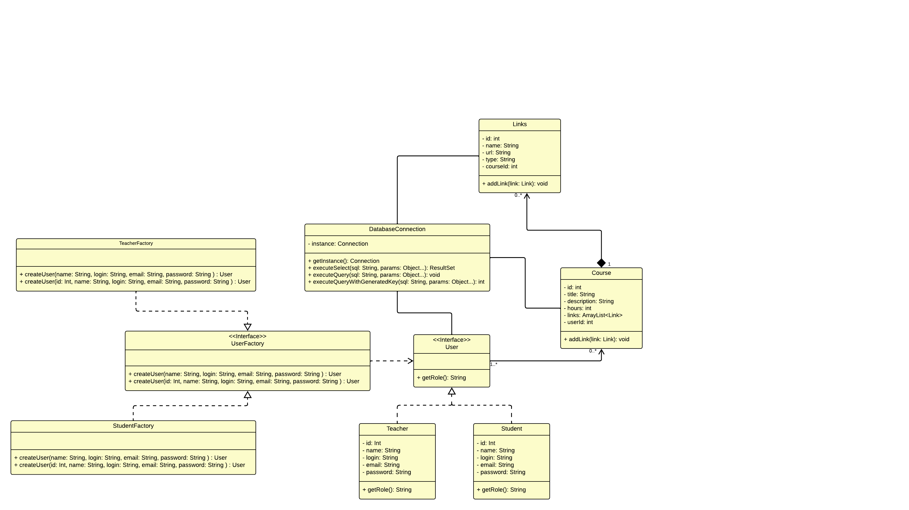
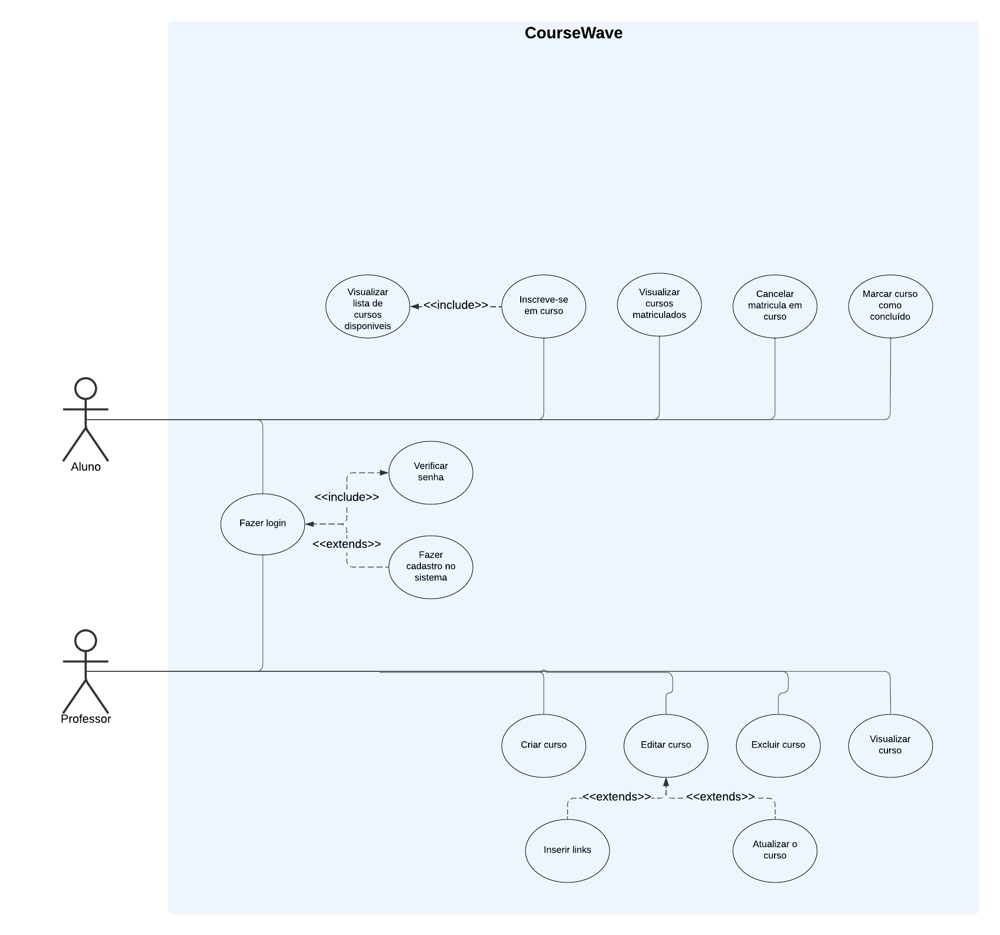

# CourseWave

## Sumário

- [CourseWave](#coursewave)
  - [Sumário](#sumário)
  - [Introdução](#introdução)
  - [Sobre o Projeto](#sobre-o-projeto)
  - [Participantes](#participantes)
  - [Tecnologias](#tecnologias)
  - [Diagramas](#diagramas)
    - [Diagrama de Classes](#diagrama-de-classes)
    - [Diagrama de Casos de Uso](#diagrama-de-casos-de-uso)
  - [Requisitos](#requisitos)
    - [Requisitos Funcionais](#requisitos-funcionais)
    - [Requisitos Não Funcionais](#requisitos-não-funcionais)
  - [Padrões de Projeto](#padrões-de-projeto)
  - [Como Rodar o Projeto](#como-rodar-o-projeto)
    - [Pré-requisitos](#pré-requisitos)
    - [Passos para Configuração](#passos-para-configuração)
    - [Informações Adicionais](#informações-adicionais)
  - [Versões das Dependências](#versões-das-dependências)

## Introdução

O **CourseWave** é um sistema de gerenciamento de cursos online que permite a professores criar, editar e excluir cursos, além de fornecer um painel para visualizar e gerenciar suas disciplinas. Alunos podem se registrar, inscrever-se em cursos e acessar o conteúdo. O sistema foi projetado com foco na simplicidade, eficiência e boas práticas de desenvolvimento de software.

## Sobre o Projeto

O **CourseWave** foi desenvolvido para atender as necessidades de gerenciamento de cursos e usuários. Professores podem gerenciar seus cursos, enquanto alunos podem explorar o catálogo de cursos e se inscrever. A aplicação segue o padrão de arquitetura MVC (Model-View-Controller) e utiliza DAOs (Data Access Objects) para manipulação do banco de dados, além de padrões de projeto como Singleton e Factory para manter uma estrutura organizada e escalável.

## Participantes

- **Jhoan Fernandes** - Desenvolvedor FullStack
- **João Augusto** - Desenvolvedor Backend
- **Luis Felipe** - Designer de UI/UX e Front-end
- **Pedro Augusto** - Tester

## Tecnologias

O projeto **CourseWave** foi construído utilizando as seguintes tecnologias:

- **Java**: Linguagem de programação principal.
- **Jakarta Servlet**: Para processamento de requisições HTTP.
- **JSP (JavaServer Pages)**: Para renderização de páginas dinâmicas.
- **MySQL**: Banco de dados relacional.
- **HTML, CSS, JavaScript**: Para construção da interface do usuário.

## Diagramas

### Diagrama de Classes



### Diagrama de Casos de Uso



## Requisitos

### Requisitos Funcionais

- **RF01**: Professores e alunos devem poder realizar cadastro e login.
- **RF02**: Professores podem criar, editar e excluir cursos, além de gerenciar suas informações.
- **RF03**: Alunos podem se inscrever, visualizar e cancelar matrícula em cursos.
- **RF04**: O sistema deve redirecionar os usuários para seus respectivos painéis, dependendo do tipo de usuário (professor ou aluno).

### Requisitos Não Funcionais

- **RNF01**: O sistema deve utilizar criptografia para proteger as senhas dos usuários.
- **RNF02**: O sistema deve ser compatível com os navegadores mais populares (Chrome, Firefox, Safari).
- **RNF03**: O código deve ser bem documentado para facilitar manutenção e expansão futura.

## Padrões de Projeto

- **Singleton**: Usado na classe `DatabaseConnection` para garantir uma única instância de conexão com o banco de dados.
- **Factory**: Aplicado na criação de diferentes tipos de usuários (professores e alunos) com base nas informações fornecidas no cadastro.

## Como Rodar o Projeto

### Pré-requisitos

Antes de iniciar, você precisa ter as seguintes ferramentas instaladas:

- **JDK (Java Development Kit)**: Versão 21 ou superior.
- **Apache Tomcat**: Servidor de aplicações web (Tomcat 10 ou superior).
- **MySQL**: Banco de dados relacional.
- **Maven**: Gerenciador de dependências e build.
- **IDE**: IntelliJ IDEA ou Eclipse são recomendados.

### Passos para Configuração

1. **Clone o Repositório**:
   Execute o comando abaixo para clonar o repositório:
   ```bash
   git clone https://github.com/JhoanDev/CourseWave.git
   ```

2. **Configuração do Banco de Dados**:
   - Crie o banco de dados MySQL usando o arquivo `src/main/resources/db/create.sql`.
   - Atualize as credenciais de conexão no arquivo `DatabaseConnection.java` com seu usuário e senha do MySQL.

3. **Configuração do Servidor Tomcat**:
   - Configure o Apache Tomcat na sua IDE de preferência. Certifique-se de que a porta configurada no Tomcat esteja livre.

4. **Construção do Projeto**:
   - Compile o projeto e baixe as dependências com Maven, usando o comando:
   ```bash
   mvn clean install
   ```

5. **Execução do Projeto**:
   - Inicie o servidor Tomcat pela IDE ou via terminal.
   - Acesse o projeto no navegador por meio da URL:
   ```
   http://localhost:8081/course_wave_war_exploded/
   ```

### Informações Adicionais

- Verifique se as portas do MySQL e do Tomcat estão configuradas corretamente. Se necessário, ajuste as configurações de porta nos arquivos do servidor ou banco de dados.

## Versões das Dependências

Abaixo estão as versões das dependências utilizadas no projeto:

```xml
<dependencies>
    <dependency>
        <groupId>com.google.code.gson</groupId>
        <artifactId>gson</artifactId>
        <version>2.10.1</version>
    </dependency>

    <dependency>
        <groupId>jakarta.platform</groupId>
        <artifactId>jakarta.jakartaee-api</artifactId>
        <version>10.0.0</version>
        <scope>provided</scope>
    </dependency>

    <dependency>
        <groupId>org.glassfish</groupId>
        <artifactId>jakarta.json</artifactId>
        <version>2.0.1</version>
    </dependency>

    <dependency>
        <groupId>mysql</groupId>
        <artifactId>mysql-connector-java</artifactId>
        <version>8.0.33</version>
    </dependency>

    <dependency>
        <groupId>jakarta.servlet</groupId>
        <artifactId>jakarta.servlet-api</artifactId>
        <version>6.0.0</version>
        <scope>provided</scope>
    </dependency>

    <dependency>
        <groupId>org.junit.jupiter</groupId>
        <artifactId>junit-jupiter-engine</artifactId>
        <version>5.11.0-M2</version>
        <scope>test</scope>
    </dependency>
</dependencies>
```