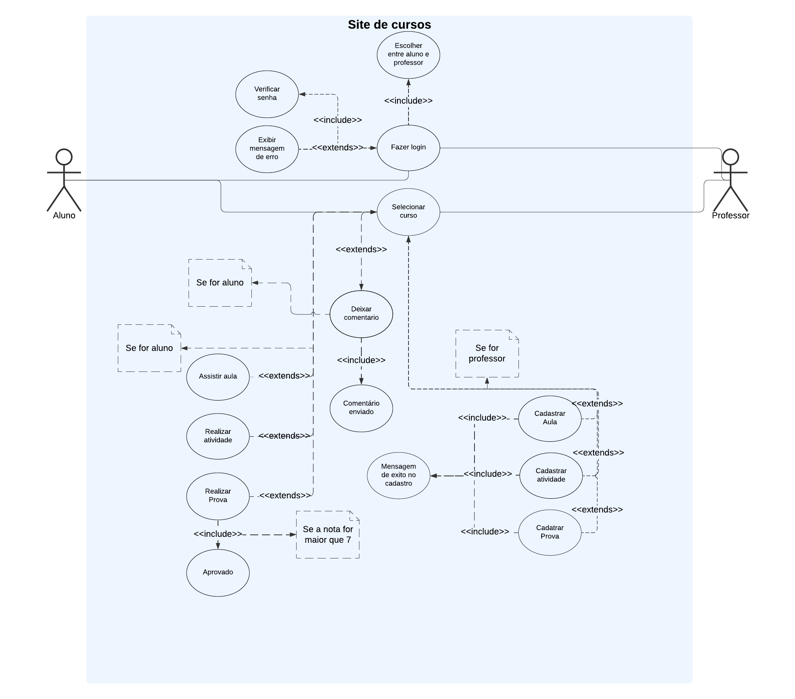

# CourseWave

## Sumário

- [CourseWave](#coursewave)
  - [Sumário](#sumário)
  - [Introdução](#introdução)
  - [Sobre o Projeto](#sobre-o-projeto)
  - [Participantes](#participantes)
  - [Tecnologias](#tecnologias)
  - [Diagramas](#diagramas)
    - [Diagrama de Classes](#diagrama-de-classes)
    - [Diagrama de Casos de Uso](#diagrama-de-casos-de-uso)
  - [Requisitos](#requisitos)
    - [Requisitos Funcionais](#requisitos-funcionais)
    - [Requisitos Não Funcionais](#requisitos-não-funcionais)
  - [Padrões de Projeto](#padrões-de-projeto)

## Introdução

Bem-vindo ao CourseWave! Este projeto é uma plataforma educacional desenvolvida para fornecer um ambiente de aprendizado interativo para alunos e instrutores. O objetivo principal é facilitar o gerenciamento e o acesso ao conteúdo educacional, melhorar a interação entre alunos e instrutores e acompanhar o progresso dos alunos de maneira eficiente.

## Sobre o Projeto

O Course Wave é uma aplicação web baseada em Java Spring Boot que utiliza o padrão MVC (Model-View-Controller) para oferecer uma experiência de aprendizado online. A plataforma permite o registro de usuários, autenticação, inscrição em cursos, acesso a conteúdos, e oferece funcionalidades para o gerenciamento de cursos e avaliações. Além disso, inclui funcionalidades de feedback e monitoramento do progresso dos alunos.

## Participantes

- **Jhoan Fernandes** - Desenvolvedor FullStack
- **João Augusto** - Desenvolvedor Backend
- **Luis Felipe** - Designer de UI/UX e Front-end
- **Pedro Augusto** - Tester

## Tecnologias

O projeto é desenvolvido com as seguintes tecnologias:
- **Java Spring Boot** - Framework para o desenvolvimento do backend.
- **Thymeleaf** - Motor de templates para a construção das views.
- **MySQL** - Banco de dados relacional para armazenar dados da aplicação.
- **Bootstrap** - Framework CSS para estilização das páginas.
- **JUnit** - Framework para testes unitários e de integração.
- **Git** - Controle de versão.

## Diagramas

### Diagrama de Classes

O Diagrama de Classes mostra as principais entidades do sistema e seus relacionamentos, incluindo `User`, `Course`, `Enrollment`, e `Feedback`.

### Diagrama de Casos de Uso

O Diagrama de Casos de Uso ilustra as interações entre os usuários (alunos e professores) e o sistema.

## Requisitos

### Requisitos Funcionais

1. **Cadastro de Usuário**: O sistema deve permitir que novos usuários (alunos e professores) se registrem na plataforma, fornecendo informações básicas como nome, e-mail e senha.
2. **Autenticação e Login**: Usuários devem poder acessar a plataforma através de login com e-mail e senha cadastrados.
3. **Inscrição em Cursos**: Alunos devem poder se inscrever em qualquer curso disponível na plataforma para acessar seu conteúdo.
4. **Acesso ao Conteúdo do Curso**: Após a inscrição, os alunos devem ter acesso completo ao conteúdo do curso, incluindo artigos, atividades e uma avaliação final.
5. **Gerenciamento de Cursos, Avaliações e Atividades**: Instrutores devem poder criar e gerenciar cursos, incluindo a criação de avaliações e atividades, enquanto os alunos devem poder entregar e participar dessas atividades.
6. **Feedback e Comentários**: Alunos devem poder enviar feedback e fazer comentários em cada módulo dos cursos, facilitando a interação com instrutores e outros alunos.
7. **Progresso do Curso**: O sistema deve monitorar e exibir o progresso do aluno em cada curso, mostrando a porcentagem de conclusão.

### Requisitos Não Funcionais

1. **Segurança**: O sistema deve implementar criptografia para proteger as senhas e informações sensíveis dos usuários.
2. **Compatibilidade**: O sistema deve funcionar corretamente nos principais navegadores da web, como Chrome, Firefox e Safari.
3. **Manutenibilidade**: O código deve ser bem documentado para facilitar a manutenção e possíveis expansões futuras.

## Padrões de Projeto

O projeto utiliza os seguintes padrões de projeto:

- **Observer Pattern (Padrão Observador)**: Usado para notificar alunos sobre atualizações de cursos e outros eventos importantes, permitindo uma comunicação eficiente e em tempo real entre o sistema e os usuários.
- **Strategy Pattern (Padrão Estratégia)**: Implementado para definir e alterar estratégias de avaliação de cursos dinamicamente, permitindo flexibilidade na forma como as notas e avaliações são calculadas.
