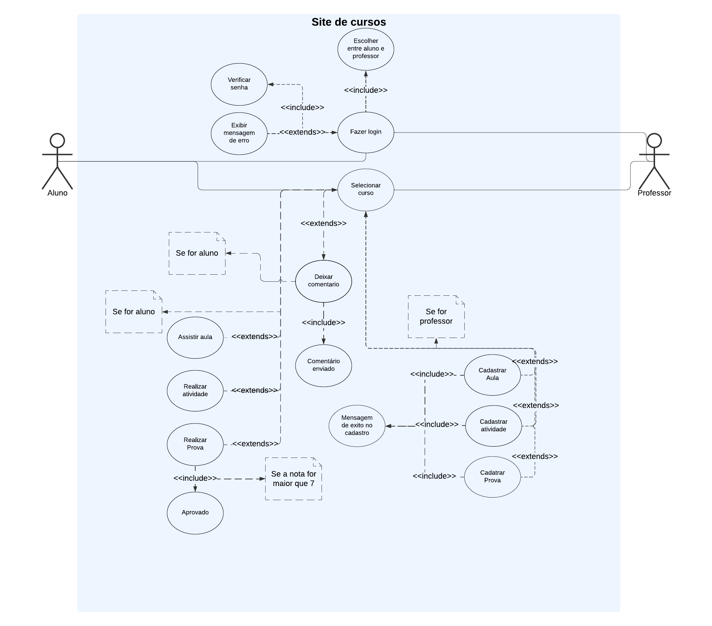

# CourseWave

## Sumário

- [Sumário](#sumário)
- [Introdução](#introdução)
- [Sobre o Projeto](#sobre-o-projeto)
- [Participantes](#participantes)
- [Tecnologias](#tecnologias)
- [Diagramas](#diagramas)
  - [Diagrama de Classes](#diagrama-de-classes)
  - [Diagrama de Casos de Uso](#diagrama-de-casos-de-uso)
- [Requisitos](#requisitos)
  - [Requisitos Funcionais](#requisitos-funcionais)
  - [Requisitos Não Funcionais](#requisitos-não-funcionais)
- [Padrões de Projeto](#padrões-de-projeto)
## Introdução

O **CourseWave** é um sistema de gerenciamento de cursos online que permite a professores cadastrar, atualizar e excluir cursos, além de fornecer um painel para visualizar informações de suas disciplinas. Alunos podem se registrar no sistema para se inscreverem em cursos e vizualizarem o conteúdo. O projeto foi desenvolvido com foco na simplicidade e eficiência, aplicando boas práticas de desenvolvimento de software e padrões de projeto.

## Sobre o Projeto

Este sistema foi desenvolvido para atender às necessidades básicas de gerenciamento de cursos e de usuários. Ele possibilita o cadastro de novos usuários (professores e alunos), o gerenciamento de cursos pelos professores e a navegação pelos alunos. Ele foi estruturado com base nos princípios da arquitetura MVC, utilizando DAOs para acesso ao banco de dados e a aplicação de padrões de projeto, como Singleton e Factory.

## Participantes

- **Jhoan Fernandes** - Desenvolvedor FullStack
- **João Augusto** - Desenvolvedor Backend
- **Luis Felipe** - Designer de UI/UX e Front-end
- **Pedro Augusto** - Tester

## Tecnologias

O projeto **CourseWave** foi construído utilizando as seguintes tecnologias:

- **Java**: Linguagem de programação principal.
- **Jakarta Servlet**: Para lidar com as requisições HTTP.
- **JSP (JavaServer Pages)**: Para renderização dinâmica no lado do servidor.
- **MySQL**: Banco de dados relacional para armazenamento de informações.
- **HTML, CSS, JavaScript**: Para a interface do usuário.

## Diagramas

### Diagrama de Classes

O Diagrama de Classes mostra as principais entidades do sistema e seus relacionamentos, incluindo `Usuario`, `Curso` entre outros.

### Diagrama de Casos de Uso

O Diagrama de Casos de Uso ilustra as interações entre os usuários (alunos e professores) e o sistema.

## Requisitos

### Requisitos Funcionais

- **RF01**: O sistema deve permitir que **professores** e **alunos** realizem o login e o cadastro, garantindo a autenticação de suas credenciais.

- **RF02**: O sistema deve permitir que **professores** criem novos cursos com as seguintes funcionalidades:
  - **RF02.1**: Inclusão de detalhes como título, descrição, carga horária e links adicionais de conteúdo.
  - **RF02.2**: Capacidade de adicionar ou remover links dinamicamente.

- **RF03**: O sistema deve permitir que **professores** gerenciem seus cursos cadastrados, com as seguintes funcionalidades:
  - **RF03.1**: Visualizar a lista de cursos cadastrados.
  - **RF03.2**: Editar as informações dos cursos.
  - **RF03.3**: Excluir cursos cadastrados.

- **RF04**: O sistema deve permitir que **alunos** inscrevam-se em cursos com a capacidade de:
  - **RF04.1**: Verificar e confirmar a matrícula no curso.

- **RF05**: O sistema deve permitir que **alunos** visualizem os cursos nos quais estão matriculados e realizem as seguintes ações:
  - **RF05.1**: Cancelar a matrícula em um curso.
  - **RF05.2**: Marcar o curso como concluído após completá-lo.

- **RF06**: O sistema deve redirecionar automaticamente os usuários para seus respectivos painéis de controle, com base em seu papel:
  - **RF06.1**: Professores são redirecionados para o painel de gerenciamento de cursos.
  - **RF06.2**: Alunos são redirecionados para o painel de visualização e gerenciamento de suas matrículas.

### Requisitos Não Funcionais

- **RNF01**: O sistema deve implementar criptografia para proteger as senhas e informações sensíveis dos usuários.
- **RNF02**: O sistema deve funcionar corretamente nos principais navegadores da web, como Chrome, Firefox e Safari.
- **RNF03**: O código deve ser bem documentado para facilitar a manutenção e possíveis expansões futuras.

## Padrões de Projeto

O projeto **CourseWave** aplica os seguintes padrões de projeto:

1. **Singleton**: Utilizado na classe `DatabaseConnection` para garantir que apenas uma instância de conexão com o banco de dados seja criada ao longo da aplicação.
   
2. **Factory**: Implementado para a criação de diferentes tipos de usuários (alunos e professores) no sistema, permitindo que o sistema escolha o tipo de usuário adequado com base nas informações fornecidas no cadastro.

Esses padrões foram implementados com o objetivo de melhorar a organização e a escalabilidade do projeto, tornando o código mais fácil de manter e estender conforme as necessidades futuras.
